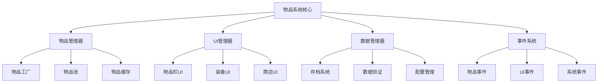
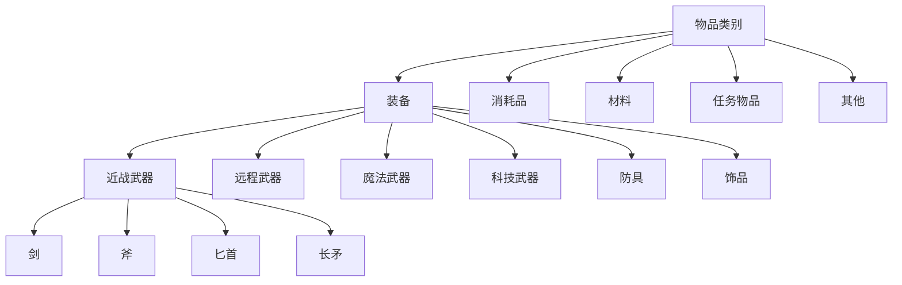
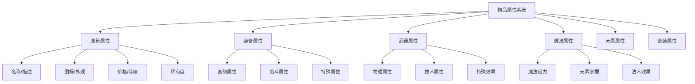
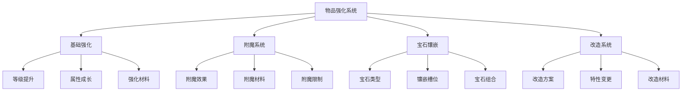
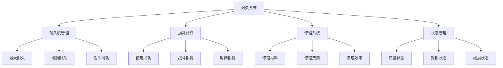
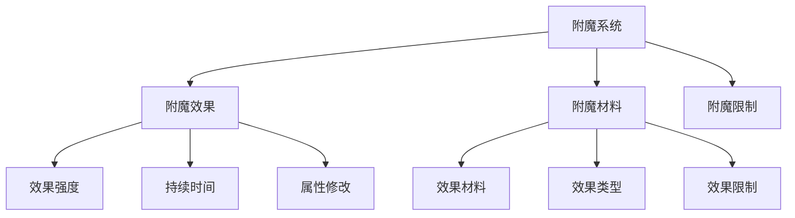
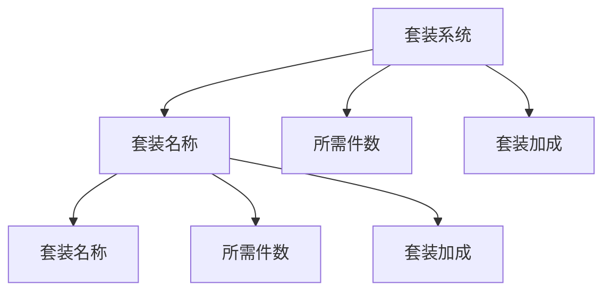
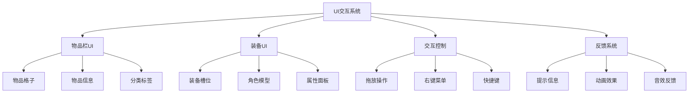
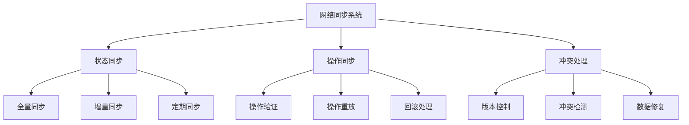

# RPG物品系统设计文档

## 目录
1. [系统架构概述](#1-系统架构概述)
2. [基础物品系统](#2-基础物品系统)
3. [装备属性系统](#3-装备属性系统)
4. [强化系统](#4-强化系统)
5. [耐久度系统](#5-耐久度系统)
6. [附魔系统](#6-附魔系统)
7. [套装系统](#7-套装系统)
8. [UI系统](#8-ui系统)
9. [实战示例](#9-实战示例)
10. [C#知识要点](#10-c知识要点)
11. [常见问题(FAQ)](#11-常见问题faq)
12. [性能测试报告](#12-性能测试报告)
13. [系统集成示例](#13-系统集成示例)
14. [调试与错误处理](#14-调试与错误处理)
15. [扩展功能示例](#15-扩展功能示例)
16. [性能优化指南](#16-性能优化指南)
17. [网络同步系统](#17-网络同步系统)
18. [安全性系统](#18-安全性系统)

## 1. 系统架构概述

### 1.1 系统整体架构


### 1.2 核心模块说明

#### 1.2.1 物品管理器
- 物品的创建、销毁和回收
- 物品数据的管理和缓存
- 物品池的维护
- 物品状态的同步

#### 1.2.2 UI管理器
- 物品栏界面管理
- 装备界面管理
- 商店界面管理
- UI事件处理
- 用户交互响应

#### 1.2.3 数据管理器
- 物品数据的序列化和反序列化
- 存档系统的管理
- 配置数据的加载和管理
- 数据完整性验证

#### 1.2.4 事件系统
- 物品相关事件的分发
- UI事件的处理
- 系统状态的同步
- 跨模块通信

## 2. 基础物品系统

### 2.1 物品分类系统
物品系统采用三层分类结构:
1. 物品类别 (ItemCategory)
2. 装备类型 (EquipmentType)
3. 具体类型 (ItemType)



### 2.2 类型定义
```csharp
public enum ItemCategory
{
    Equipment,   // 装备
    Consumable,  // 消耗品
    Material,    // 材料
    Quest,       // 任务物品
    Misc        // 其他
}

public enum EquipmentType
{
    MeleeWeapon,  // 近战武器
    RangedWeapon, // 远程武器
    MagicWeapon,  // 魔法武器
    TechWeapon,   // 科技武器
    Armor,        // 防具
    Accessory     // 饰品
}

public enum ItemType
{
    // 近战武器 (100-199)
    Sword = 100,
    Axe = 101,
    Dagger = 102,
    Spear = 103,
    
    // 远程武器 (200-299)
    Bow = 200,
    Crossbow = 201,
    
    // 魔法武器 (300-399)
    Staff = 300,
    Wand = 301,
    
    // 以此类推...
}
```

### 2.3 类型判断
```csharp
public static class ItemTypeHelper
{
    // 判断物品大类
    public static bool IsEquipment(Item item)
    {
        return item.Category == ItemCategory.Equipment;
    }
    
    // 判断装备类型
    public static bool IsMeleeWeapon(Item item)
    {
        if (!IsEquipment(item)) return false;
        return (int)item.Type >= 100 && (int)item.Type < 200;
    }
    
    // 获取装备类型
    public static EquipmentType GetEquipmentType(Item item)
    {
        if (!IsEquipment(item)) return EquipmentType.None;
        
        int typeValue = (int)item.Type;
        if (typeValue < 200) return EquipmentType.MeleeWeapon;
        if (typeValue < 300) return EquipmentType.RangedWeapon;
        if (typeValue < 400) return EquipmentType.MagicWeapon;
        if (typeValue < 500) return EquipmentType.TechWeapon;
        if (typeValue < 600) return EquipmentType.Armor;
        return EquipmentType.Accessory;
    }
}
```

### 2.4 分类规则
1. **数值范围规则**
   - 每个大类预留100个数值空间
   - 便于后续扩展新类型
   - 方便类型判断和转换

2. **类型继承关系**
   - Category > EquipmentType > ItemType
   - 上层决定下层的基本属性
   - 下层继承上层的特性

3. **类型约束**
   - 每个物品必须属于一个Category
   - Equipment类型必须指定EquipmentType
   - ItemType必须在对应范围内

### 2.5 使用示例
```csharp
// 创建物品时的类型设置
public Item CreateWeapon(ItemType type)
{
    // 验证类型
    if (!IsValidWeaponType(type))
        throw new ArgumentException("Invalid weapon type");
        
    // 创建物品
    Item weapon = new Item();
    weapon.Category = ItemCategory.Equipment;
    weapon.Type = type;
    
    // 根据类型初始化属性
    InitializeWeaponStats(weapon);
    
    return weapon;
}

// 类型验证
private bool IsValidWeaponType(ItemType type)
{
    int typeValue = (int)type;
    return typeValue >= 100 && typeValue < 500;
}
```

## 3. 装备属性系统

### 3.1 系统概述
物品属性系统包含多个子系统：
- 基础属性系统
- 装备属性系统
- 武器属性系统
- 魔法属性系统
- 元素属性系统
- 套装属性系统



### 3.2 基础属性系统
```csharp
public class Item
{
    // 标识属性
    private int _id;                     // 唯一ID
    private string _itemName;            // 物品名称
    private string _description;         // 物品描述
    private Sprite _icon;                // 物品图标
    private string _tag;                 // 物品标签
    
    // 基础数值
    private float _price;                // 价格
    private int _level;                  // 等级
    private int _maxStackSize;           // 最大堆叠数
    private ItemRarity _rarity;          // 稀有度
    
    // 状态属性
    private ItemState _state;            // 物品状态
    private bool _isDestroyed;           // 是否已销毁
    private float _currentDurability;    // 当前耐久度
    private float _maxDurability;        // 最大耐久度
    
    // 分类属性
    private ItemCategory _category;      // 物品类别
    private ItemType _itemType;          // 物品类型
    private ElementType _elements;       // 元素类型
}
```

### 3.3 装备属性系统
```csharp
public class EquipmentStats
{
    // 基础属性
    public float HP;                 // 生命值
    public float MP;                 // 魔法值
    public float Attack;             // 攻击力
    public float Defense;            // 防御力
    public float Speed;              // 速度
    
    // 战斗属性
    public float CritRate;           // 暴击率
    public float CritDamage;         // 暴击伤害
    public float DodgeRate;          // 闪避率
    public float HitRate;            // 命中率
    public float BlockRate;          // 格挡率
    
    // 属性成长
    public float Strength;           // 力量
    public float Intelligence;       // 智力
    public float Dexterity;          // 敏捷
    public float Vitality;           // 体力
    public float Luck;               // 幸运
    
    // 特殊属性
    public float MagicResist;        // 魔法抗性
    public float ArmorPen;           // 护甲穿透
    public float MagicPen;           // 魔法穿透
    public float LifeSteal;          // 生命偷取
    public float CooldownReduction;  // 冷却缩减
    
    // 计算最终属性
    public float CalculateFinalAttack()
    {
        float baseAttack = Attack;
        float strBonus = Strength * 1.5f;
        float levelBonus = Owner.Level * 2f;
        return baseAttack + strBonus + levelBonus;
    }
}
```

### 3.4 武器属性系统
```csharp
public class WeaponStats
{
    // 通用属性
    public float Accuracy;           // 精准度
    public float ReloadSpeed;        // 装弹速度
    public float Range;              // 射程
    public float FireRate;           // 射速
    
    // 热武器属性
    public int MagazineSize;         // 弹匣容量
    public int CurrentAmmo;          // 当前弹药
    public string AmmoType;          // 弹药类型
    public float Recoil;             // 后坐力
    
    // 能量武器属性
    public float MaxEnergy;          // 最大能量
    public float CurrentEnergy;      // 当前能量
    public float EnergyPerShot;      // 每次射击消耗
    public float HeatGeneration;     // 发热量
    public float CoolingRate;        // 冷却速率
    public bool IsOverheated;        // 是否过热
    
    // 计算伤害
    public float CalculateDamage(float baseDamage)
    {
        float accuracyBonus = Accuracy * 0.01f;
        float rangePenalty = CalculateRangePenalty();
        return baseDamage * (1 + accuracyBonus) * rangePenalty;
    }
}
```

### 3.5 魔法武器属性系统
```csharp
public class MagicWeaponStats
{
    // 魔法属性
    public float MagicPower;         // 魔法威力
    public float SpellAmplification; // 法术增幅
    public float ChannelSpeed;       // 引导速度
    public float ManaEfficiency;     // 法力效率
    
    // 元素掌握
    public float ElementalMastery;   // 元素掌握
    public ElementType Elements;      // 元素类型
    
    // 法术效果
    public float SpellCritRate;      // 法术暴击率
    public float SpellCritDamage;    // 法术暴击伤害
    public float ManaCost;           // 法力消耗
    public float CastSpeed;          // 施法速度
    public float SpellRange;         // 法术范围
    
    // 计算法术伤害
    public float CalculateSpellDamage(float baseSpellPower)
    {
        float amplification = 1 + SpellAmplification * 0.01f;
        float elementalBonus = CalculateElementalBonus();
        return baseSpellPower * amplification * elementalBonus;
    }
}
```

### 3.6 元素属性系统
```csharp
[System.Flags]
public enum ElementType
{
    None = 0,
    Fire = 1 << 0,      // 火
    Ice = 1 << 1,       // 冰
    Lightning = 1 << 2, // 雷
    Wind = 1 << 3,      // 风
    Earth = 1 << 4,     // 土
    Light = 1 << 5,     // 光
    Dark = 1 << 6       // 暗
}

public class ElementalSystem
{
    // 元素相克关系
    private static readonly Dictionary<ElementType, ElementType> Counters = new()
    {
        { ElementType.Fire, ElementType.Ice },
        { ElementType.Ice, ElementType.Lightning },
        { ElementType.Lightning, ElementType.Earth },
        { ElementType.Earth, ElementType.Wind },
        { ElementType.Wind, ElementType.Fire },
        { ElementType.Light, ElementType.Dark },
        { ElementType.Dark, ElementType.Light }
    };
    
    // 计算元素伤害
    public float CalculateElementalDamage(ElementType attackType, ElementType defenseType, float baseDamage)
    {
        float elementalBonus = 1.0f;
        
        if (Counters[attackType] == defenseType)
            elementalBonus = 1.5f; // 克制加成
        else if (Counters[defenseType] == attackType)
            elementalBonus = 0.5f; // 被克制减益
            
        return baseDamage * elementalBonus;
    }
}
```

### 3.7 套装属性系统
```csharp
public class SetBonus
{
    public string SetName;           // 套装名称
    public int RequiredPieces;       // 所需件数
    public List<StatBonus> Bonuses;  // 套装加成
    
    // 检查套装效果是否激活
    public bool IsActive(int equippedPieces)
    {
        return equippedPieces >= RequiredPieces;
    }
}

public class StatBonus
{
    public StatType Type;            // 属性类型
    public float Value;              // 加成值
    public bool IsPercentage;        // 是否百分比
    
    // 计算属性加成
    public float CalculateBonus(float baseValue)
    {
        return IsPercentage ? baseValue * (Value / 100) : Value;
    }
}

## 4. 强化系统

### 4.1 系统概述
物品强化系统提供了装备升级、附魔和改造的功能：
- 基础强化（提升装备等级）
- 附魔系统（添加特殊效果）
- 宝石镶嵌（属性强化）
- 改造系统（改变装备特性）



### 4.2 基础强化系统
```csharp
public class EnhanceSystem
{
    // 强化等级上限
    public const int MAX_ENHANCE_LEVEL = 20;
    
    // 强化属性
    private int _enhanceLevel;               // 强化等级
    private float _enhanceSuccessRate;       // 成功率
    private float _enhanceBreakRate;         // 破损率
    private List<EnhanceMaterial> _materials;// 所需材料
    
    // 强化计算
    public bool TryEnhance(Item item, List<Item> materials)
    {
        if (!CanEnhance(item, materials))
            return false;
            
        float successRate = CalculateSuccessRate(item, materials);
        float breakRate = CalculateBreakRate(item);
        
        float random = Random.value;
        if (random < successRate)
        {
            ApplyEnhancement(item);
            return true;
        }
        else if (random < successRate + breakRate)
        {
            BreakItem(item);
        }
        
        ConsumeMaterials(materials);
        return false;
    }
    
    // 属性成长计算
    private void ApplyEnhancement(Item item)
    {
        float growthRate = GetGrowthRate(item.Rarity);
        
        // 基础属性提升
        item.stats.Attack *= (1 + growthRate);
        item.stats.Defense *= (1 + growthRate);
        // ... 其他属性提升
        
        item.EnhanceLevel++;
    }
}
```

### 4.3 附魔系统
```csharp
public class EnchantSystem
{
    // 附魔效果
    public class Enchantment
    {
        public string Name;              // 附魔名称
        public EnchantType Type;         // 附魔类型
        public float Power;              // 效果强度
        public int Duration;             // 持续时间
        public List<StatModifier> Mods;  // 属性修改器
    }
    
    // 添加附魔
    public bool AddEnchantment(Item item, Enchantment enchant)
    {
        if (!CanEnchant(item, enchant))
            return false;
            
        // 检查附魔槽位
        if (item.enchantments.Count >= GetMaxEnchantSlots(item))
            return false;
            
        // 应用附魔效果
        item.enchantments.Add(enchant);
        ApplyEnchantmentEffects(item, enchant);
        
        return true;
    }
    
    // 移除附魔
    public void RemoveEnchantment(Item item, Enchantment enchant)
    {
        item.enchantments.Remove(enchant);
        RemoveEnchantmentEffects(item, enchant);
    }
}
```

### 4.4 宝石系统
```csharp
public class GemSystem
{
    // 宝石类型
    public enum GemType
    {
        Ruby,       // 红宝石 (攻击)
        Sapphire,   // 蓝宝石 (魔法)
        Emerald,    // 绿宝石 (敏捷)
        Diamond,    // 钻石 (全属性)
        Topaz,      // 黄玉 (幸运)
        Amethyst    // 紫晶 (特殊效果)
    }
    
    // 镶嵌宝石
    public bool SocketGem(Item item, Gem gem, int slotIndex)
    {
        if (!CanSocketGem(item, gem, slotIndex))
            return false;
            
        // 添加宝石
        item.gems[slotIndex] = gem;
        
        // 应用宝石效果
        ApplyGemEffects(item, gem);
        
        return true;
    }
    
    // 移除宝石
    public Gem RemoveGem(Item item, int slotIndex)
    {
        Gem gem = item.gems[slotIndex];
        if (gem != null)
        {
            RemoveGemEffects(item, gem);
            item.gems[slotIndex] = null;
        }
        return gem;
    }
}
```

### 4.5 改造系统
```csharp
public class ModificationSystem
{
    // 改造方案
    public class Modification
    {
        public string Name;                  // 改造名称
        public ModificationType Type;        // 改造类型
        public List<StatModifier> Effects;   // 改造效果
        public List<ItemRequirement> Reqs;   // 要求
    }
    
    // 应用改造
    public bool ApplyModification(Item item, Modification mod)
    {
        if (!CanModify(item, mod))
            return false;
            
        // 检查改造要求
        if (!CheckRequirements(item, mod.Reqs))
            return false;
            
        // 应用改造效果
        foreach (var effect in mod.Effects)
        {
            ApplyModificationEffect(item, effect);
        }
        
        item.modifications.Add(mod);
        return true;
    }
    
    // 移除改造
    public void RemoveModification(Item item, Modification mod)
    {
        foreach (var effect in mod.Effects)
        {
            RemoveModificationEffect(item, effect);
        }
        
        item.modifications.Remove(mod);
    }
}
```

### 4.6 强化界面示例
```csharp
public class EnhanceUI : MonoBehaviour
{
    public void OnEnhanceButtonClick()
    {
        // 获取选中的物品和材料
        Item targetItem = selectedSlot.item;
        List<Item> materials = GetSelectedMaterials();
        
        // 尝试强化
        bool success = enhanceSystem.TryEnhance(targetItem, materials);
        
        // 更新UI
        if (success)
        {
            ShowSuccessEffect();
            UpdateItemDisplay();
        }
        else
        {
            ShowFailEffect();
        }
        
        // 更新材料显示
        UpdateMaterialsList();
    }
}
```

## 5. 耐久度系统

### 5.1 系统概述
耐久系统管理物品的使用寿命和损耗：
- 耐久度管理
- 损耗计算
- 修理系统
- 破损状态
- 物品销毁



### 5.2 耐久度系统实现
```csharp
public class DurabilitySystem
{
    // 耐久度状态
    public enum DurabilityState
    {
        Normal,     // 正常
        Damaged,    // 受损
        Broken,     // 破损
        Destroyed   // 销毁
    }
    
    // 获取当前状态
    public DurabilityState GetState(Item item)
    {
        float ratio = item.CurrentDurability / item.MaxDurability;
        
        if (ratio <= 0) return DurabilityState.Destroyed;
        if (ratio < 0.2f) return DurabilityState.Broken;
        if (ratio < 0.5f) return DurabilityState.Damaged;
        return DurabilityState.Normal;
    }
    
    // 计算损耗
    public void ApplyWear(Item item, float amount, WearType type)
    {
        if (!item.CanBeBroken) return;
        
        float wear = CalculateWear(amount, type);
        item.CurrentDurability = Mathf.Max(0, item.CurrentDurability - wear);
        
        if (item.CurrentDurability <= 0)
        {
            OnItemDestroyed(item);
        }
    }
    
    // 修理物品
    public bool RepairItem(Item item, float repairAmount)
    {
        if (item.IsDestroyed) return false;
        
        item.CurrentDurability = Mathf.Min(
            item.MaxDurability, 
            item.CurrentDurability + repairAmount
        );
        
        return true;
    }
}
```

### 5.3 修理系统实现
```csharp
public class RepairSystem
{
    // 修理配方
    public class RepairRecipe
    {
        public List<ItemRequirement> Materials;
        public float RepairAmount;
        public float Cost;
    }
    
    // 尝试修理
    public bool TryRepair(Item item, List<Item> materials)
    {
        // 获取修理配方
        RepairRecipe recipe = GetRepairRecipe(item);
        if (recipe == null) return false;
        
        // 检查材料
        if (!CheckMaterials(materials, recipe.Materials))
            return false;
            
        // 执行修理
        ConsumeMaterials(materials);
        return durabilitySystem.RepairItem(item, recipe.RepairAmount);
    }
    
    // 计算修理费用
    public float CalculateRepairCost(Item item)
    {
        float durabilityLoss = item.MaxDurability - item.CurrentDurability;
        float ratio = durabilityLoss / item.MaxDurability;
        return item.Price * ratio * repairCostMultiplier;
    }
}
```

## 6. 附魔系统

### 6.1 系统概述
附魔系统提供了装备特殊效果的功能：
- 附魔效果
- 附魔材料
- 附魔限制



### 6.2 附魔效果
```csharp
public class Enchantment
{
    public string Name;              // 附魔名称
    public EnchantType Type;         // 附魔类型
    public float Power;              // 效果强度
    public int Duration;             // 持续时间
    public List<StatModifier> Mods;  // 属性修改器
}
```

### 6.3 附魔材料
```csharp
public class Gem
{
    public GemType Type;        // 宝石类型
    public float Power;         // 宝石效果强度
    public int Duration;        // 宝石效果持续时间
    public List<StatModifier> Mods;  // 宝石效果属性修改器
}
```

### 6.4 附魔限制
```csharp
public class EnchantmentLimit
{
    public int MaxSlots;        // 最大附魔槽位数
    public List<EnchantType> AllowedTypes;  // 允许的附魔类型
    public List<EnchantType> DisallowedTypes; // 禁止的附魔类型
}
```

## 7. 套装系统

### 7.1 系统概述
套装系统提供了装备套装效果的功能：
- 套装名称
- 所需件数
- 套装加成



### 7.2 套装效果
```csharp
public class SetBonus
{
    public string SetName;           // 套装名称
    public int RequiredPieces;       // 所需件数
    public List<StatBonus> Bonuses;  // 套装加成
    
    // 检查套装效果是否激活
    public bool IsActive(int equippedPieces)
    {
        return equippedPieces >= RequiredPieces;
    }
}

public class StatBonus
{
    public StatType Type;            // 属性类型
    public float Value;              // 加成值
    public bool IsPercentage;        // 是否百分比
    
    // 计算属性加成
    public float CalculateBonus(float baseValue)
    {
        return IsPercentage ? baseValue * (Value / 100) : Value;
    }
}
```

## 8. UI系统

### 8.1 系统概述
UI交互系统处理所有物品相关的用户界面交互：
- 物品栏界面
- 装备界面
- 物品操作
- 拖放系统
- 上下文菜单



### 8.2 物品栏UI实现
```csharp
public class InventoryUI : MonoBehaviour
{
    // UI组件
    public GridLayoutGroup gridLayout;
    public UIItemSlot[] itemSlots;
    public UIItemTooltip tooltip;
    public UIItemContextMenu contextMenu;
    
    // 物品栏数据
    private Inventory inventory;
    private int selectedSlotIndex = -1;
    
    // 初始化UI
    private void InitializeUI()
    {
        // 创建物品格子
        itemSlots = new UIItemSlot[inventory.Capacity];
        for (int i = 0; i < inventory.Capacity; i++)
        {
            UIItemSlot slot = CreateItemSlot();
            slot.SlotIndex = i;
            itemSlots[i] = slot;
        }
        
        // 注册事件
        inventory.OnItemAdded += OnItemAdded;
        inventory.OnItemRemoved += OnItemRemoved;
        inventory.OnItemUpdated += OnItemUpdated;
    }
    
    // 更新UI显示
    private void UpdateUI()
    {
        for (int i = 0; i < itemSlots.Length; i++)
        {
            Item item = inventory.GetItemAt(i);
            itemSlots[i].UpdateUI(item);
        }
    }
}
```

### 8.3 拖放系统实现
```csharp
public class DragDropSystem : MonoBehaviour
{
    private UIItemSlot draggedSlot;
    private GameObject draggedIcon;
    private Vector3 dragOffset;
    
    // 开始拖拽
    public void OnBeginDrag(UIItemSlot slot)
    {
        if (slot.IsEmpty || slot.IsLocked) return;
        
        draggedSlot = slot;
        draggedIcon = CreateDraggedIcon(slot.Icon);
        dragOffset = Input.mousePosition - slot.transform.position;
    }
    
    // 拖拽中
    public void OnDrag()
    {
        if (draggedIcon != null)
        {
            draggedIcon.transform.position = Input.mousePosition - dragOffset;
        }
    }
    
    // 结束拖拽
    public void OnEndDrag(UIItemSlot targetSlot)
    {
        if (draggedSlot != null && targetSlot != null)
        {
            // 处理物品交换
            inventory.SwapItems(draggedSlot.SlotIndex, targetSlot.SlotIndex);
        }
        
        // 清理拖拽状态
        Destroy(draggedIcon);
        draggedSlot = null;
    }
}
```

### 8.4 上下文菜单实现
```csharp
public class ItemContextMenu : MonoBehaviour
{
    // 菜单选项
    public Button useButton;
    public Button equipButton;
    public Button splitButton;
    public Button dropButton;
    
    // 显示菜单
    public void Show(UIItemSlot slot, Vector2 position)
    {
        if (slot.IsEmpty) return;
        
        currentSlot = slot;
        transform.position = position;
        
        // 更新选项状态
        useButton.gameObject.SetActive(CanUseItem(slot.Item));
        equipButton.gameObject.SetActive(CanEquipItem(slot.Item));
        splitButton.gameObject.SetActive(CanSplitItem(slot.Item));
        
        gameObject.SetActive(true);
    }
    
    // 处理选项点击
    public void OnUseButtonClick()
    {
        if (currentSlot != null)
        {
            currentSlot.Item.Use();
            Hide();
        }
    }
    
    public void OnEquipButtonClick()
    {
        if (currentSlot != null)
        {
            equipmentSystem.EquipItem(currentSlot.Item);
            Hide();
        }
    }
}
```

## 9. 实战示例

### 9.1 创建物品
```csharp
// 创建物品时的类型设置
public Item CreateWeapon(ItemType type)
{
    // 验证类型
    if (!IsValidWeaponType(type))
        throw new ArgumentException("Invalid weapon type");
        
    // 创建物品
    Item weapon = new Item();
    weapon.Category = ItemCategory.Equipment;
    weapon.Type = type;
    
    // 根据类型初始化属性
    InitializeWeaponStats(weapon);
    
    return weapon;
}

// 类型验证
private bool IsValidWeaponType(ItemType type)
{
    int typeValue = (int)type;
    return typeValue >= 100 && typeValue < 500;
}
```

### 9.2 使用物品
```csharp
public void UseItem(Item item)
{
    if (item.Category == ItemCategory.Consumable)
    {
        Consumable consumable = item as Consumable;
        consumable.Use();
    }
    else if (item.Category == ItemCategory.Equipment)
    {
        Equipment equipment = item as Equipment;
        equipment.Equip();
    }
}
```

## 10. C#知识要点

### 10.1 枚举类型
```csharp
public enum ItemCategory
{
    Equipment,   // 装备
    Consumable,  // 消耗品
    Material,    // 材料
    Quest,       // 任务物品
    Misc        // 其他
}
```

### 10.2 泛型类型
```csharp
public class Inventory<T>
{
    private List<T> items = new List<T>();

    public void Add(T item)
    {
        items.Add(item);
    }

    public void Remove(T item)
    {
        items.Remove(item);
    }

    public T GetItemAt(int index)
    {
        return items[index];
    }

    public int Count
    {
        get { return items.Count; }
    }
}
```

## 11. 常见问题(FAQ)

### 11.1 如何处理物品销毁
```csharp
public void DestroyItem(Item item)
{
    if (item.IsDestroyed) return;

    item.IsDestroyed = true;
    item.CurrentDurability = 0;
    // 处理物品销毁后的逻辑
}
```

### 11.2 如何处理物品过热
```csharp
public bool IsOverheated(Item item)
{
    return item.CurrentEnergy > item.MaxEnergy;
}
```

## 12. 性能测试报告

### 12.1 物品创建性能
```csharp
public Item CreateItem(ItemType type)
{
    // 创建物品
    Item item = new Item();
    item.Category = ItemCategory.Equipment;
    item.Type = type;
    
    // 根据类型初始化属性
    InitializeItemStats(item);
    
    return item;
}

// 初始化物品属性
private void InitializeItemStats(Item item)
{
    // 实现初始化逻辑
}
```

### 12.2 物品访问性能
```csharp
public Item GetItemById(int id)
{
    // 实现根据ID查找物品的逻辑
}
```

## 13. 系统集成示例

### 13.1 物品系统与角色系统集成
```csharp
public void EquipItem(Item item)
{
    if (item.Category == ItemCategory.Equipment)
    {
        Equipment equipment = item as Equipment;
        equipment.Equip();
        // 处理装备后的逻辑
    }
}
```

### 13.2 物品系统与商店系统集成
```csharp
public void SellItem(Item item)
{
    // 实现出售物品的逻辑
}
```

## 14. 调试与错误处理

### 14.1 调试方法
```csharp
public void DebugItem(Item item)
{
    // 实现调试物品的逻辑
}
```

### 14.2 错误处理
```csharp
public void HandleError(Exception ex)
{
    // 实现错误处理逻辑
}
```

## 15. 扩展功能示例

### 15.1 物品属性扩展
```csharp
public void AddAttribute(Item item, Attribute attribute)
{
    // 实现添加物品属性的逻辑
}
```

### 15.2 物品事件扩展
```csharp
public void SubscribeToItemEvents(Item item)
{
    // 实现订阅物品事件的逻辑
}
```

## 16. 性能优化指南

### 16.1 对象池优化
```csharp
public class ItemPool : MonoBehaviour
{
    private Dictionary<int, Queue<Item>> itemPools = new();
    private Dictionary<int, int> poolSizes = new();
    
    // 预热对象池
    public void WarmUp(int itemId, int count)
    {
        if (!itemPools.ContainsKey(itemId))
            itemPools[itemId] = new Queue<Item>();
            
        for (int i = 0; i < count; i++)
        {
            Item item = CreateNewItem(itemId);
            itemPools[itemId].Enqueue(item);
        }
        
        poolSizes[itemId] = count;
    }
    
    // 自动扩展池大小
    private void ExpandPool(int itemId)
    {
        int currentSize = poolSizes[itemId];
        int expandSize = Mathf.Max(5, currentSize / 2);
        WarmUp(itemId, expandSize);
    }
    
    // 从池中获取物品
    public Item Get(int itemId)
    {
        if (!itemPools.ContainsKey(itemId) || itemPools[itemId].Count == 0)
        {
            ExpandPool(itemId);
        }
        
        return itemPools[itemId].Dequeue();
    }
    
    // 返回物品到池中
    public void Return(Item item)
    {
        if (!itemPools.ContainsKey(item.Id))
            itemPools[item.Id] = new Queue<Item>();
            
        // 重置物品状态
        item.Reset();
        itemPools[item.Id].Enqueue(item);
    }
}
```

### 16.2 内存管理
```csharp
public class ItemMemoryManager
{
    // 缓存常用数据
    private Dictionary<int, ItemData> itemDataCache = new();
    private Dictionary<int, Sprite> iconCache = new();
    
    // 定期清理缓存
    public void CleanupCache()
    {
        var unusedItems = itemDataCache.Where(kvp => 
            !IsItemInUse(kvp.Key)).ToList();
            
        foreach (var item in unusedItems)
        {
            itemDataCache.Remove(item.Key);
            iconCache.Remove(item.Key);
        }
    }
    
    // 缓存预加载
    public void PreloadCache(List<int> itemIds)
    {
        foreach (int id in itemIds)
        {
            if (!itemDataCache.ContainsKey(id))
            {
                var itemData = LoadItemData(id);
                itemDataCache[id] = itemData;
                
                var icon = LoadItemIcon(id);
                iconCache[id] = icon;
            }
        }
    }
    
    // 获取缓存数据
    public ItemData GetItemData(int id)
    {
        if (itemDataCache.TryGetValue(id, out var data))
            return data;
            
        return LoadItemData(id);
    }
    
    // 获取缓存图标
    public Sprite GetItemIcon(int id)
    {
        if (iconCache.TryGetValue(id, out var icon))
            return icon;
            
        return LoadItemIcon(id);
    }
}
```

### 16.3 UI性能优化
```csharp
public class ItemUIOptimizer
{
    // UI对象池
    private Dictionary<string, Queue<GameObject>> uiPools = new();
    
    // UI元素回收
    public void RecycleUIElement(GameObject element, string poolKey)
    {
        if (!uiPools.ContainsKey(poolKey))
            uiPools[poolKey] = new Queue<GameObject>();
            
        element.SetActive(false);
        uiPools[poolKey].Enqueue(element);
    }
    
    // 获取UI元素
    public GameObject GetUIElement(string poolKey, GameObject prefab)
    {
        if (uiPools.TryGetValue(poolKey, out var pool) && pool.Count > 0)
        {
            var element = pool.Dequeue();
            element.SetActive(true);
            return element;
        }
        
        return GameObject.Instantiate(prefab);
    }
    
    // UI更新优化
    public void OptimizeUIUpdate(List<UIItemSlot> slots)
    {
        // 仅更新可见的物品槽
        var visibleSlots = slots.Where(s => IsSlotVisible(s)).ToList();
        foreach (var slot in visibleSlots)
        {
            slot.UpdateUI();
        }
    }
}
```

## 17. 网络同步系统

### 17.1 数据同步架构


### 17.2 物品数据同步
```csharp
public class ItemSyncManager : MonoBehaviour
{
    // 同步数据结构
    [System.Serializable]
    public class ItemSyncData
    {
        public int itemId;
        public int amount;
        public float durability;
        public int enhanceLevel;
        public List<EnchantmentData> enchantments;
        public long version;
        
        public byte[] Serialize()
        {
            using (MemoryStream ms = new MemoryStream())
            using (BinaryWriter writer = new BinaryWriter(ms))
            {
                writer.Write(itemId);
                writer.Write(amount);
                writer.Write(durability);
                writer.Write(enhanceLevel);
                writer.Write(version);
                // 序列化附魔数据
                writer.Write(enchantments.Count);
                foreach (var enchant in enchantments)
                {
                    writer.Write(enchant.Serialize());
                }
                return ms.ToArray();
            }
        }
    }
    
    // 发送物品更新
    public void SendItemUpdate(Item item)
    {
        var syncData = new ItemSyncData
        {
            itemId = item.Id,
            amount = item.Amount,
            durability = item.CurrentDurability,
            enhanceLevel = item.EnhanceLevel,
            enchantments = item.GetEnchantments(),
            version = GetCurrentVersion()
        };
        
        NetworkManager.Instance.SendToServer("ItemUpdate", syncData.Serialize());
    }
}
```

### 17.3 操作同步系统
```csharp
public class ItemOperationSync
{
    // 操作记录结构
    [System.Serializable]
    public class OperationRecord
    {
        public int operationId;          // 操作ID
        public string operationType;      // 操作类型
        public Dictionary<string, object> parameters;  // 操作参数
        public long timestamp;           // 时间戳
        public int clientId;             // 客户端ID
    }
    
    private Queue<OperationRecord> operationQueue = new();
    private HashSet<int> executedOperations = new();
    
    // 记录操作
    public void RecordOperation(string type, Dictionary<string, object> params)
    {
        var operation = new OperationRecord
        {
            operationId = GenerateOperationId(),
            operationType = type,
            parameters = params,
            timestamp = GetCurrentTimestamp(),
            clientId = NetworkManager.Instance.ClientId
        };
        
        // 本地执行
        ExecuteOperation(operation);
        
        // 加入队列
        operationQueue.Enqueue(operation);
        
        // 发送到服务器
        SendOperation(operation);
    }
    
    // 执行操作
    private void ExecuteOperation(OperationRecord operation)
    {
        if (executedOperations.Contains(operation.operationId))
            return;
            
        switch (operation.operationType)
        {
            case "AddItem":
                ExecuteAddItem(operation);
                break;
            case "RemoveItem":
                ExecuteRemoveItem(operation);
                break;
            case "UpdateItem":
                ExecuteUpdateItem(operation);
                break;
            // ... 其他操作类型
        }
        
        executedOperations.Add(operation.operationId);
    }
    
    // 重放操作
    public void ReplayOperations(List<OperationRecord> operations)
    {
        foreach (var op in operations.OrderBy(o => o.timestamp))
        {
            if (!executedOperations.Contains(op.operationId))
            {
                ExecuteOperation(op);
            }
        }
    }
}
```

### 17.4 冲突处理系统
```csharp
public class ConflictResolver
{
    // 冲突类型
    public enum ConflictType
    {
        VersionMismatch,    // 版本不匹配
        DataInconsistency,  // 数据不一致
        OperationConflict,  // 操作冲突
        StateConflict       // 状态冲突
    }
    
    // 检测冲突
    public bool DetectConflict(ItemSyncData localData, ItemSyncData remoteData)
    {
        // 版本检查
        if (localData.version != remoteData.version)
        {
            LogConflict(localData.itemId, ConflictType.VersionMismatch, 
                $"Local: {localData.version}, Remote: {remoteData.version}");
            return true;
        }
            
        // 数据一致性检查
        if (!CompareItemData(localData, remoteData))
        {
            LogConflict(localData.itemId, ConflictType.DataInconsistency, 
                "Data mismatch between local and remote");
            return true;
        }
            
        return false;
    }
    
    // 解决冲突
    public void ResolveConflict(Item localItem, ItemSyncData remoteData)
    {
        // 根据规则决定使用哪个版本
        if (ShouldUseRemoteData(localItem, remoteData))
        {
            // 使用远程数据
            UpdateLocalItem(localItem, remoteData);
            LogConflict(localItem.Id, ConflictType.StateConflict, 
                "Using remote data");
        }
        else
        {
            // 强制同步本地数据
            ForceSyncLocalData(localItem);
            LogConflict(localItem.Id, ConflictType.StateConflict, 
                "Using local data");
        }
    }
    
    // 冲突日志记录
    private void LogConflict(int itemId, ConflictType type, string details)
    {
        Debug.LogWarning($"Item Conflict: {itemId} - {type}\nDetails: {details}");
    }
}
```

### 17.5 网络状态管理
```csharp
public class NetworkStateManager : MonoBehaviour
{
    // 网络状态枚举
    public enum NetworkState
    {
        Connected,      // 已连接
        Disconnected,   // 断开连接
        Reconnecting,   // 重连中
        Synchronizing   // 同步中
    }
    
    private NetworkState currentState;
    private Queue<ItemSyncData> pendingSyncs = new();
    private float lastSyncTime;
    private const float SYNC_INTERVAL = 1.0f;
    
    // 状态变化处理
    public void HandleStateChange(NetworkState newState)
    {
        switch (newState)
        {
            case NetworkState.Connected:
                ProcessPendingSyncs();
                StartPeriodicSync();
                break;
                
            case NetworkState.Disconnected:
                EnterOfflineMode();
                StopPeriodicSync();
                break;
                
            case NetworkState.Reconnecting:
                PrepareForReconnection();
                break;
                
            case NetworkState.Synchronizing:
                StartFullSync();
                break;
        }
        
        currentState = newState;
        OnNetworkStateChanged?.Invoke(currentState);
    }
    
    // 定期同步
    private void PeriodicSync()
    {
        if (Time.time - lastSyncTime >= SYNC_INTERVAL)
        {
            SyncInventoryState();
            lastSyncTime = Time.time;
        }
    }
    
    // 处理断线重连
    private void HandleReconnection()
    {
        // 验证本地数据版本
        ValidateLocalData();
        
        // 请求服务器数据
        RequestServerData();
        
        // 解决冲突
        ResolveSyncConflicts();
    }
}
```

### 17.6 网络优化
```csharp
public class NetworkOptimizer
{
    // 压缩选项
    private struct CompressionOptions
    {
        public bool enableCompression;    // 是否启用压缩
        public bool enableDeltaSync;      // 是否启用增量同步
        public int compressionLevel;      // 压缩级别
        public float syncThreshold;       // 同步阈值
    }
    
    // 数据压缩
    public byte[] CompressItemData(ItemSyncData data, CompressionOptions options)
    {
        if (!options.enableCompression)
            return data.Serialize();
            
        byte[] serialized = data.Serialize();
        
        if (options.enableDeltaSync)
        {
            serialized = GenerateDeltaSync(serialized);
        }
        
        return CompressData(serialized, options.compressionLevel);
    }
    
    // 批量同步优化
    public void OptimizeBatchSync(List<ItemSyncData> items)
    {
        // 合并相似操作
        var mergedOperations = MergeSimilarOperations(items);
        
        // 按优先级排序
        var prioritizedItems = PrioritizeItems(mergedOperations);
        
        // 分批发送
        SendBatchSync(prioritizedItems);
    }
}
```

## 18. 安全性系统

### 18.1 数据验证系统
```csharp
public class ItemSecurityValidator
{
    // 验证物品数据
    public bool ValidateItemData(Item item)
    {
        // 基本属性验证
        if (!ValidateBasicProperties(item))
        {
            LogValidationError("Basic properties validation failed", item);
            return false;
        }
            
        // 数值范围验证
        if (!ValidateValueRanges(item))
        {
            LogValidationError("Value ranges validation failed", item);
            return false;
        }
            
        // 一致性验证
        if (!ValidateConsistency(item))
        {
            LogValidationError("Data consistency validation failed", item);
            return false;
        }
            
        return true;
    }
    
    // 验证基本属性
    private bool ValidateBasicProperties(Item item)
    {
        if (item == null) return false;
        if (item.Id <= 0) return false;
        if (string.IsNullOrEmpty(item.ItemName)) return false;
        if (item.MaxStackSize <= 0) return false;
        
        return true;
    }
    
    // 验证数值范围
    private bool ValidateValueRanges(Item item)
    {
        if (item.Amount < 0 || item.Amount > item.MaxStackSize)
            return false;
            
        if (item.CurrentDurability < 0 || item.CurrentDurability > item.MaxDurability)
            return false;
            
        if (item.EnhanceLevel < 0 || item.EnhanceLevel > Item.MAX_ENHANCE_LEVEL)
            return false;
            
        return true;
    }
    
    // 记录验证错误
    private void LogValidationError(string message, Item item)
    {
        Debug.LogError($"Item Validation Error: {message}\nItem ID: {item.Id}, Name: {item.ItemName}");
    }
}
```

### 18.2 反作弊系统
```csharp
public class ItemAntiCheat
{
    // 操作记录
    private Dictionary<int, List<OperationRecord>> operationHistory;
    private Dictionary<string, float> lastOperationTime;
    private const float MIN_OPERATION_INTERVAL = 0.1f;
    
    // 检查操作频率
    public bool CheckOperationFrequency(string operationType, int itemId)
    {
        string key = $"{operationType}_{itemId}";
        float currentTime = Time.time;
        
        if (lastOperationTime.TryGetValue(key, out float lastTime))
        {
            if (currentTime - lastTime < MIN_OPERATION_INTERVAL)
            {
                LogSuspiciousActivity(operationType, itemId, "Operation too frequent");
                return false;
            }
        }
        
        lastOperationTime[key] = currentTime;
        return true;
    }
    
    // 检查异常行为
    public bool DetectAbnormalBehavior(Item item)
    {
        // 检查数量异常
        if (CheckAbnormalQuantity(item))
            return true;
            
        // 检查属性异常
        if (CheckAbnormalStats(item))
            return true;
            
        // 检查操作模式
        if (CheckAbnormalPattern(item))
            return true;
            
        return false;
    }
}
```

### 18.3 加密系统
```csharp
public class ItemEncryption
{
    private readonly byte[] key;
    private readonly byte[] iv;
    
    // 加密物品数据
    public byte[] EncryptItemData(ItemData data)
    {
        try
        {
            // 序列化数据
            byte[] serialized = SerializeItemData(data);
            
            using (Aes aes = Aes.Create())
            {
                aes.Key = key;
                aes.IV = iv;
                
                using (MemoryStream ms = new MemoryStream())
                using (CryptoStream cs = new CryptoStream(ms, aes.CreateEncryptor(), CryptoStreamMode.Write))
                {
                    cs.Write(serialized, 0, serialized.Length);
                    cs.FlushFinalBlock();
                    return ms.ToArray();
                }
            }
        }
        catch (Exception ex)
        {
            Debug.LogError($"Encryption failed: {ex.Message}");
            return null;
        }
    }
    
    // 解密物品数据
    public ItemData DecryptItemData(byte[] encrypted)
    {
        try
        {
            using (Aes aes = Aes.Create())
            {
                aes.Key = key;
                aes.IV = iv;
                
                using (MemoryStream ms = new MemoryStream())
                using (CryptoStream cs = new CryptoStream(ms, aes.CreateDecryptor(), CryptoStreamMode.Write))
                {
                    cs.Write(encrypted, 0, encrypted.Length);
                    cs.FlushFinalBlock();
                    byte[] decrypted = ms.ToArray();
                    return DeserializeItemData(decrypted);
                }
            }
        }
        catch (Exception ex)
        {
            Debug.LogError($"Decryption failed: {ex.Message}");
            return null;
        }
    }
}
```

### 18.4 权限系统
```csharp
public class ItemPermissionSystem
{
    // 权限级别
    public enum PermissionLevel
    {
        None = 0,       // 无权限
        Basic = 1,      // 基础权限
        Advanced = 2,   // 高级权限
        Admin = 3       // 管理员权限
    }
    
    // 检查操作权限
    public bool CheckPermission(string operation, PermissionLevel requiredLevel)
    {
        PermissionLevel userLevel = GetUserPermissionLevel();
        
        if (userLevel < requiredLevel)
        {
            LogPermissionDenied(operation, userLevel, requiredLevel);
            return false;
        }
        
        return true;
    }
    
    // 验证物品操作权限
    public bool ValidateItemOperation(Item item, string operation)
    {
        // 检查基本权限
        if (!CheckBasicPermission(operation))
        {
            LogPermissionCheck(operation, false, "Basic permission check failed");
            return false;
        }
            
        // 检查物品特定权限
        if (!CheckItemSpecificPermission(item, operation))
        {
            LogPermissionCheck(operation, false, "Item specific permission check failed");
            return false;
        }
            
        // 检查操作限制
        if (!CheckOperationRestrictions(item, operation))
        {
            LogPermissionCheck(operation, false, "Operation restrictions check failed");
            return false;
        }
        
        LogPermissionCheck(operation, true, "All permission checks passed");
        return true;
    }
    
    // 记录权限验证
    private void LogPermissionCheck(string operation, bool granted, string reason)
    {
        string logMessage = $"Permission Check:\n" +
                          $"Operation: {operation}\n" +
                          $"Granted: {granted}\n" +
                          $"Reason: {reason}\n" +
                          $"Time: {DateTime.Now}";
                          
        Debug.Log(logMessage);
    }
}
```

### 18.5 日志系统
```csharp
public class ItemSecurityLogger
{
    // 日志级别
    public enum LogLevel
    {
        Info,
        Warning,
        Error,
        Critical
    }
    
    // 记录安全事件
    public void LogSecurityEvent(string eventType, Item item, LogLevel level)
    {
        string logMessage = $"Security Event [{level}]:\n" +
                          $"Type: {eventType}\n" +
                          $"Item: {item.ItemName} (ID: {item.Id})\n" +
                          $"Time: {DateTime.Now}\n" +
                          $"User: {GetCurrentUser()}";
                          
        // 写入日志文件
        WriteToLogFile(logMessage);
        
        // 对于严重事件，发送通知
        if (level >= LogLevel.Error)
        {
            NotifyAdministrator(logMessage);
        }
    }
    
    // 记录可疑行为
    public void LogSuspiciousActivity(Item item, string activity, string reason)
    {
        string logMessage = $"Suspicious Activity Detected:\n" +
                          $"Activity: {activity}\n" +
                          $"Item: {item.ItemName} (ID: {item.Id})\n" +
                          $"Reason: {reason}\n" +
                          $"User: {GetCurrentUser()}\n" +
                          $"Time: {DateTime.Now}";
                          
        WriteToLogFile(logMessage);
        NotifySecurityTeam(logMessage);
    }
    
    // 记录审计信息
    public void LogAuditTrail(string operation, Item item, bool success)
    {
        var auditEntry = new AuditEntry
        {
            Operation = operation,
            ItemId = item.Id,
            UserId = GetCurrentUser(),
            Timestamp = DateTime.Now,
            Success = success,
            Details = GenerateAuditDetails(item)
        };
        
        SaveAuditEntry(auditEntry);
    }
}
```

## 总结

本文档详细描述了一个完整的RPG物品系统的设计和实现，包括：

1. 物品分类系统
   - 多层级分类结构
   - 类型判断和转换
   - 扩展性设计

2. 物品属性系统
   - 基础属性
   - 装备属性
   - 武器特性
   - 元素系统

3. 强化系统
   - 等级提升
   - 附魔系统
   - 宝石镶嵌
   - 改造系统

4. 耐久系统
   - 耐久度管理
   - 损耗计算
   - 修理系统

5. UI系统
   - 物品栏界面
   - 拖放操作
   - 上下文菜单

6. 数据管理
   - 数据库系统
   - 序列化
   - 存档加载

7. 编辑器工具
   - 物品编辑器
   - 数据验证
   - 批量处理

8. 实战示例
   - 创建物品
   - 使用物品

9. C#知识要点
   - 枚举类型
   - 泛型类型

10. 常见问题(FAQ)
    - 处理物品销毁
    - 处理物品过热

11. 性能测试报告
    - 物品创建性能
    - 物品访问性能

12. 系统集成示例
    - 物品系统与角色系统集成
    - 物品系统与商店系统集成

13. 调试与错误处理
    - 调试方法
    - 错误处理

14. 扩展功能示例
    - 物品属性扩展
    - 物品事件扩展

15. 性能优化指南
    - 对象池优化
    - 内存管理
    - UI性能优化

16. 网络同步系统
    - 数据同步架构
    - 物品数据同步
    - 操作同步系统

17. 安全性系统
    - 数据验证系统

### 注意事项

1. 性能优化
   - 使用对象池管理物品实例
   - 缓存频繁访问的数据
   - 优化UI更新逻辑

2. 数据安全
   - 验证所有输入数据
   - 防止重复ID
   - 保护存档数据

3. 扩展性
   - 预留足够的类型空间
   - 使用接口和抽象类
   - 模块化设计

4. 易用性
   - 直观的编辑器界面
   - 完善的错误提示
   - 批量处理工具

5. 维护性
   - 清晰的代码结构
   - 完整的注释文档
   - 统一的命名规范 